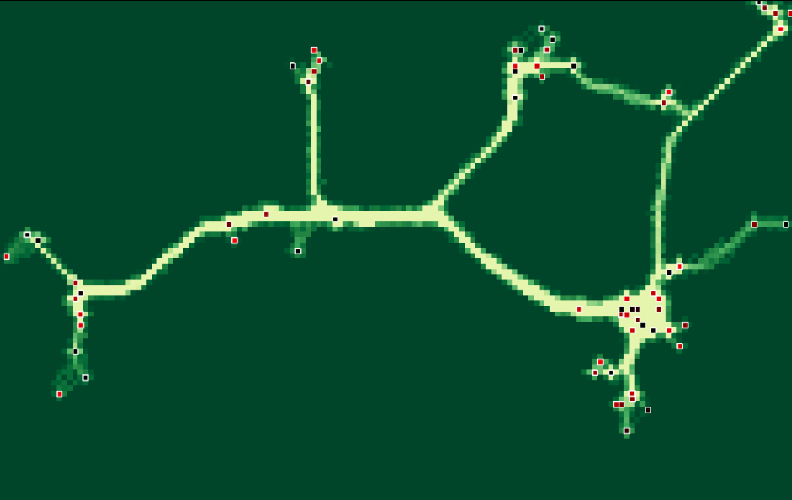

# Paths

A desire-path simulator. Agents walk between buildings on a grid. Repeated traversal wears down tile costs, and emergent paths form over time.



## Running

```bash
uv run streamlit run app.py
```

Requires Python ≥ 3.14 and [uv](https://docs.astral.sh/uv/).

## How it works

Buildings spawn gradually on a grid, positioned by a spatial probability distribution that clusters them at medium range while preventing direct adjacency. Each building spawns agents that walk to randomly chosen destinations (weighted by attractiveness).

Every agent step adds wear to traversed tiles. Tile cost decreases as a function of accumulated wear, so frequently walked routes become cheaper — attracting more agents, reinforcing the path. Wear decays multiplicatively each step, so unused paths fade.

## Pathfinding backends

**A\*** — `python-pathfinding` with diagonal movement. Paths are cached per agent and recalculated every N steps.

**Flow field** — `scipy` Dijkstra distance fields computed per building. Agents step toward the minimum-cost neighbour, with optional softmax temperature sampling (higher temperature = more exploratory) and momentum to reduce oscillation.

## Controls

Many parameters are exposed in the Streamlit sidebar.
